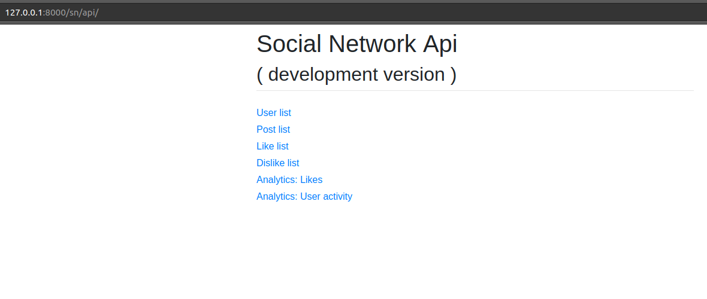
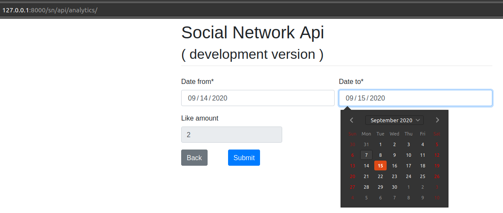

# Starnavi social network API
## About
* Designed by flurry <mailto:flurry.pa@gmail.com>

## Preview



## Build
### install from source
make sure you've installed python3.
#### 1. Create virtual environment and activate it.
```bash
python3 -m venv venv # or use which python find your python3 path
source .venv/bin/activate
```
#### 2. Install requirements

```bash
pip3 install -r requirements.txt
``` 
#### 3. Run it 
```python
python3 manage.py runserver
```
Then visit http://localhost:8000/sn/api/ you will get a preview.

#### 4. Launch bot 
python3 bot_launcher.py

Bot create users, posts, likes and dislikes.
Adjust configuration file:
 - bot/conf.json
 
Some analytics available (2 endpoints, customized views):
1) Like amount during separate time period (how many likes was made):
http://localhost:8000/sn/api/analytics/
2) User activity an endpoint which will show when user was login last time
and when he makes a last request to the service:
http://localhost:8000/sn/api/user_activity/
